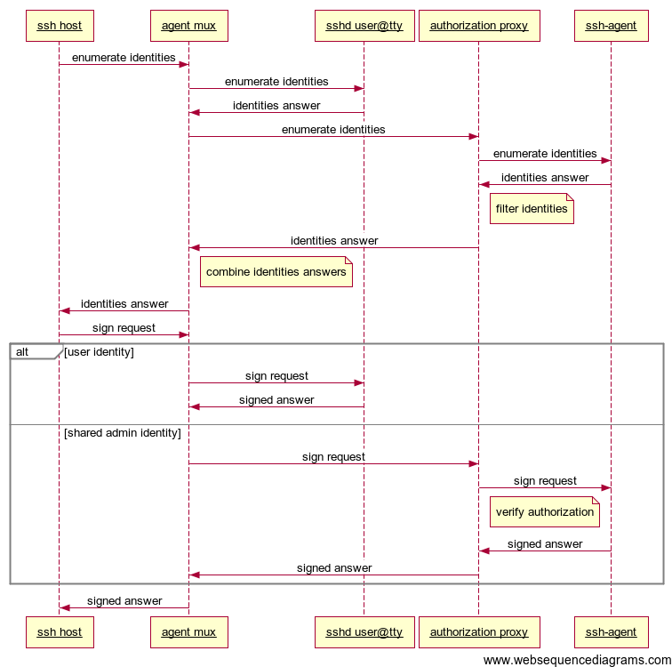

SSH Agent Background
====================

OpenSSH includes ssh-agent, a program which holds private keys used for public
key authentication. When a ssh client authenticates with a remote server and
SSH_AUTH_SOCK is set, the client will connect to the agent's authentication
socket and list the identities loaded into the agent. It then offers these
identities to the remote host and if there is a matching identity on the remote
host (in ~/.ssh/authorized_keys) the remote host will reply with a challenge
for that identity. The client then sends that challenge to the agent and the
agent returns the challenge signed with the private key of the identity. The
client then sends this signed challenge to the remote host, thereby proving it
has access to the identity. In the case of RSA key authentication, the remote
host verifies the signed challenge by decrypting it the public key thereby
proving the client had use of the private key. Other identity types work
similarly.

The ssh client enables forwarding the agent connection to remote hosts,
allowing a user to login to a third host using the identities stored on their
local machine. This forwarding process can be repeated as necessary.

We can use this framework to allow groups of local users to use identities
stored in one restricted user account. This allows a teams to share a common
set of authentication credentials without giving each member a copy of these
credentials, thus providing a single point to grant and revoke access.

Here is a diagram of a normal authentication sequence:


The authorization proxy and ssh-agent are running as a separate user which has
the shared authentication credentials.

Agent Multiplexer
=================

The ssh agent multiplexer is invoked by each user at login. It examines their
environment for an existing forwarded SSH authentication socket and creates a
new listening authentication socket. The multiplexer acts as a proxy for each
ssh authentication socket connection. For enumeration requests, it connects to
both the existing authentication socket and the authorization proxy, requests
the list of identities from each socket, and returns the combined results. For
signing requests, it forwards the request to the authentication socket which
listed that identity. All other requests are forwarded the existing
authentication socket. This allows the user to add and remove identities from
their local agent.

Authorization Proxy
===================

The authorization proxy runs as the restricted user which has access to the SSH
private keys. The key pairs for each identity are loaded into the user's SSH
agent (ssh-agent(1)) and the authorization proxy controls access to this agent.
This is necessary because ssh-agent uses both file permissions on the agent
socket and getsockopt(SOL_SOCKET, SO_PEERCRED) to restrict access the same user
as the ssh-agent is running as. By inserting this additional proxy in to the
agent path we can provide limited access to these identities to other users
with appropriate access.

The authorization proxy can share much of its code with the agent multiplexer
since it also needs to accept multiple concurrent ssh agent connections, modify
list identities responses and govern sign requests.

Authorization will be stored in a SQLite database:

```
    CREATE TABLE IF NOT EXISTS identities (
        key_digest TEXT UNIQUE NOT NULL,
        name TEXT NOT NULL
    );

    CREATE TABLE IF NOT EXISTS authorizations (
        username TEXT NOT NULL,
        identity_id INTEGER         -- REFERENCES identities(rowid)
    );
```

Setup
=====
```
    $ python setup.py install
```


Testing
=======

Start a test ssh-agent

```
    $ ssh-agent
    SSH_AUTH_SOCK=/tmp/ssh-2Lp0DynTskn4/agent.11829; export SSH_AUTH_SOCK;
    SSH_AGENT_PID=11830; export SSH_AGENT_PID;
    echo Agent pid 11830;


    $ sshagentmux --socket /tmp/ssh-2Lp0DynTskn4/agent.11829 -- ssh-add -l
```
